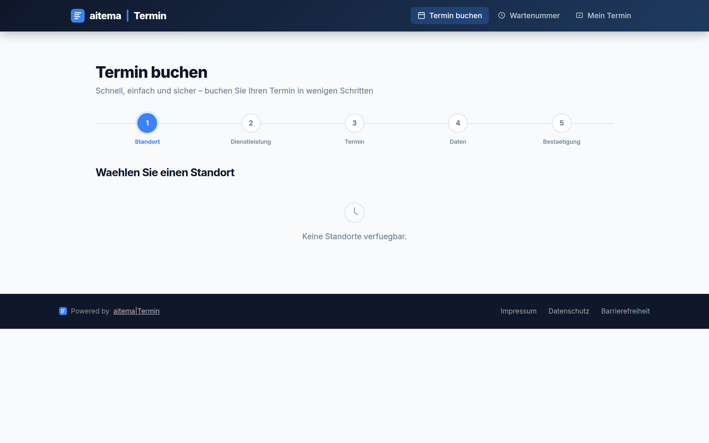
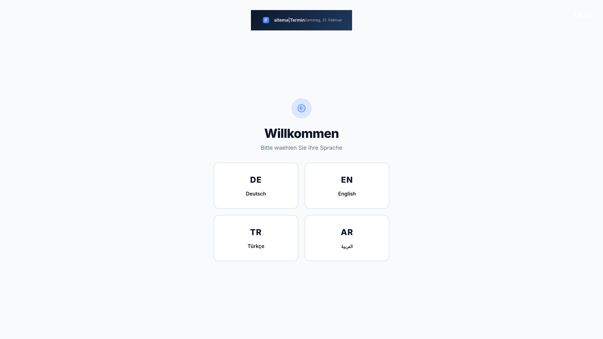
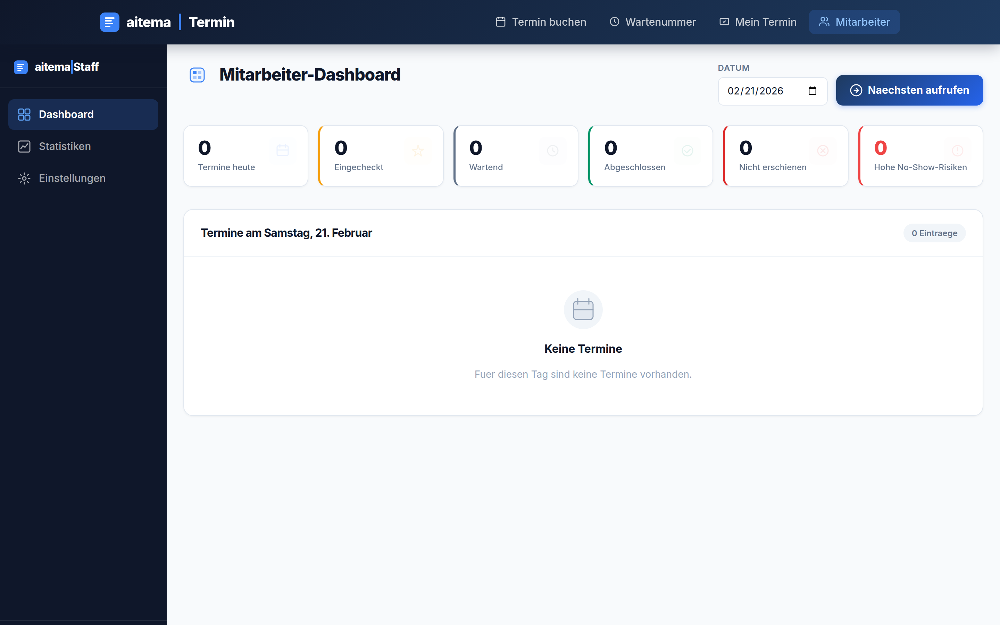

# aitema|Termin

> Moderne, barrierefreie Terminvergabe für Behörden und kommunale Dienststellen.

[\](https://termin.aitema.de)
[\](https://termin.aitema.de)
[\](https://termin.aitema.de)
[\](https://termin.aitema.de)

## Screenshots

| Buchungsportal | Buchungs-Wizard | Kiosk-Display |
|:-:|:-:|:-:|
| \ | \ | \ |

| Staff-Dashboard |
|:-:|
| \ |

## Features

### Für Bürgerinnen und Bürger
- **5-Schritt-Buchungsassistent** – Standort → Service → Termin → Daten → Bestätigung
- **QR-Code Check-in** – Termin am Kiosk scannen, kein Warten an der Theke
- **iCal-Export** – Termin direkt in Kalender übernehmen (Apple, Google, Outlook)
- **SMS-Benachrichtigung** – Erinnerung und Statusupdates via Sipgate (DSGVO-konform)
- **Mehrsprachigkeit** – DE, EN, TR, AR, RU
- **Barrierefreiheit** – WCAG 2.1 AA (BFSG-Verpflichtung ab 28.06.2025)

### Für Verwaltungsmitarbeitende
- **Live-Queue-Dashboard** – WebSocket-basierte Echtzeit-Warteschlange
- **NoShow-Scoring** – KI-gestützte Risikoeinschätzung (0–100)
- **CalDAV-Feed** – Eigene Termine direkt im Kalender (Outlook, Apple Calendar)
- **Kiosk-Display** – Großes Ticketanzeigesystem für Wartebereiche
- **Plausible Analytics** – Cookiefreie Besucherstatistiken (DSGVO, kein Banner)

## Technologie-Stack

```
Frontend:  SvelteKit + Tailwind CSS (aitema Design System)
Backend:   Fastify / Node.js + Prisma ORM
Queue:     BullMQ + Redis Pub/Sub
Datenbank: PostgreSQL 16
Echtzeit:  WebSocket (native)
Analytics: Plausible (Self-hosted)
Auth:      JWT + Keycloak SSO
Deploy:    Docker Compose + Traefik (Hetzner)
```

## Schnellstart (Entwicklung)

```bash
# Voraussetzungen: Node.js 22+, Docker
git clone https://github.com/Aitema-gmbh/terminvergabe.git
cd terminvergabe

# Backend
cd backend && cp .env.example .env && npm install && npm run dev

# Frontend (Bürger-App)
cd ../frontend && npm install && npm run dev
```

## Architektur

```
termin.aitema.de
├── /           → SvelteKit Bürger-App (Buchungsportal)
├── /buchen     → 5-Step-Booking-Wizard
├── /checkin    → QR-Code Check-in
├── /staff      → Staff-Dashboard (Keycloak-geschützt)
├── /display    → Kiosk-Anzeige (Warteraum-Monitor)
└── /api        → Fastify REST API
    ├── /api/v1/appointments
    ├── /api/v1/queue
    ├── /api/v1/services
    └── /api/v1/locations
```

## Dokumentation

- [Architektur](docs/ARCHITECTURE.md)
- [API-Referenz](docs/API.md)
- [PRD Batch 1](docs/PRD-features-2026-02.md)
- [PRD Batch 2](docs/PRD-features-2026-02-batch2.md)
- [PRD Batch 3](docs/PRD-features-2026-02-batch3.md)

## Compliance

| Anforderung | Status |
|-------------|--------|
| OZG 2.0 | ✅ |
| BFSG (WCAG 2.1 AA) | ✅ ab 28.06.2025 |
| DSGVO (kein Google Fonts, Plausible) | ✅ |
| BSI Grundschutz | 🔄 in Vorbereitung |

---

*Entwickelt von [aitema GmbH](https://aitema.de) · [Impressum](https://aitema.de/impressum)*
