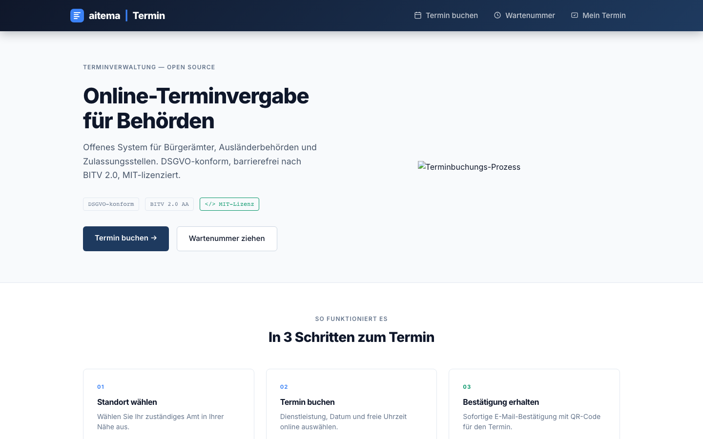
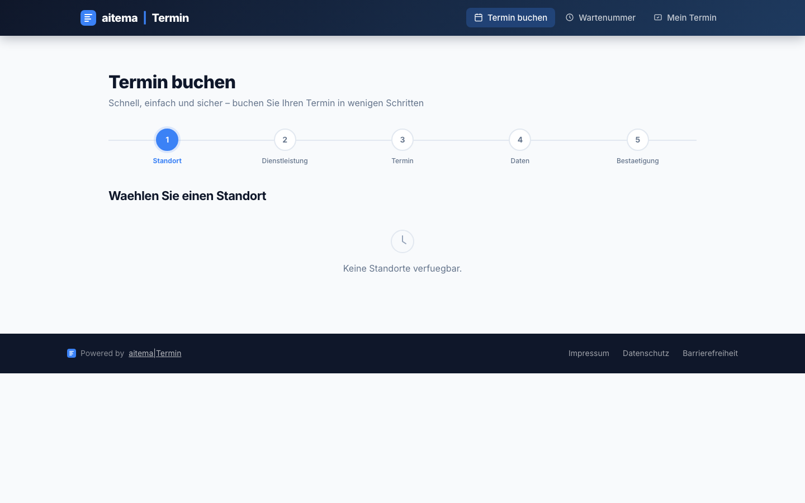
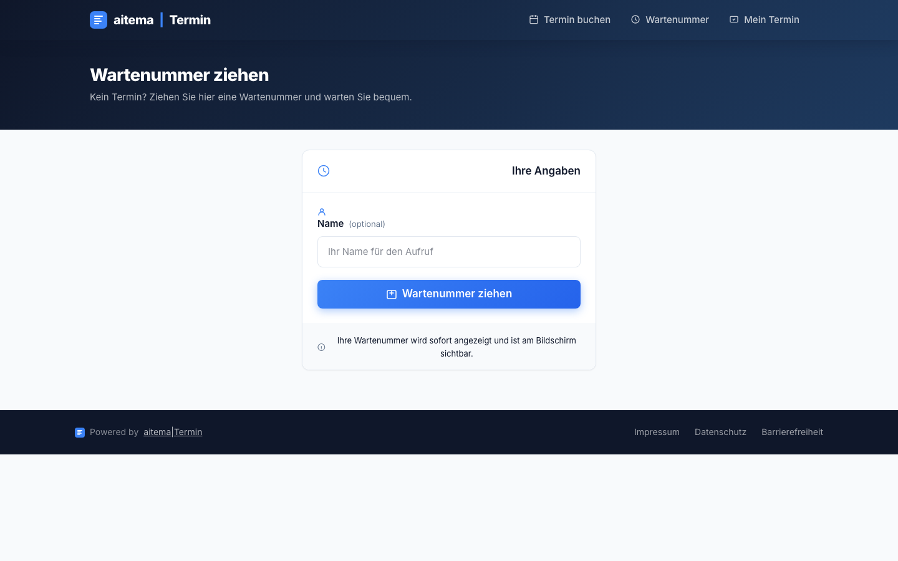

<div align="center">

# aitema|Termin

**Online-Terminvergabe für Behörden — Open Source, selbst-gehostet, DSGVO-konform**

[](LICENSE)
[](https://termin.aitema.de)
[](https://kit.svelte.dev)
[](https://dsgvo-gesetz.de)
[](https://www.gesetze-im-internet.de/bitv_2_0/)
[](docker-compose.quickstart.yml)

[**→ Live Demo**](https://termin.aitema.de) · [**Dokumentation**](docs/) · [**Bug melden**](https://github.com/Aitema-gmbh/terminvergabe/issues) · [**Diskussion**](https://github.com/Aitema-gmbh/terminvergabe/discussions)

</div>

---


## Screenshots

| Landing Page | Termin buchen | Wartenummer |
|:---:|:---:|:---:|
|  |  |  |


## Was ist aitema|Termin?

aitema|Termin ist ein vollständiges **Online-Terminvergabesystem** für Bürgerämter, Ausländerbehörden, KFZ-Zulassungsstellen und andere kommunale Dienststellen. Bürgerinnen und Bürger buchen Termine online — oder ziehen vor Ort eine digitale Wartenummer.

Das System läuft **komplett auf eurer eigenen Infrastruktur** — keine SaaS-Abhängigkeit, keine Datenweitergabe, kein Vendor Lock-in.

> **Warum Open Source?** Öffentliche Verwaltung wird mit Steuergeld finanziert. Software für die Verwaltung sollte der Öffentlichkeit gehören.

---

## Features

### 👥 Für Bürgerinnen und Bürger

| Feature | Details |
|---------|---------|
| **Online-Buchung** | 5-Schritt-Assistent: Standort → Service → Datum/Zeit → Kontakt → Bestätigung |
| **Wartenummer ziehen** | Walk-In ohne Termin: digitale Wartenummer per Browser |
| **Status prüfen** | Buchungsreferenz eingeben → aktueller Status |
| **QR-Code** | Bestätigung mit QR-Code für Check-in am Kiosk |

### 🏛️ Für Verwaltungsmitarbeitende

| Feature | Details |
|---------|---------|
| **Staff-Dashboard** | Live-Warteschlange, Nächster Aufruf, Tages-Statistiken |
| **Kiosk-Display** | Großformat-Anzeige für TV im Wartebereich, automatischer Ticket-Aufruf |
| **Echtzeit** | WebSocket-basierte Live-Queue ohne Seitenneuladung |
| **Offline-fähig** | Kiosk funktioniert auch bei Netzwerkproblemen |

---

## Compliance

| Standard | Status |
|----------|--------|
| DSGVO | ✅ konform (keine externen Dienste) |
| BITV 2.0 AA (Barrierefreiheit) | 🔄 in Arbeit |
| BFSG (Barrierefreiheitsstärkungsgesetz) | 🔄 in Arbeit |
| Open Source (MIT) | ✅ |

---

## Tech-Stack

```
Frontend (Bürger):   SvelteKit 2.12 + Svelte 5 (Runes: $state, $derived, $effect)
                     Tailwind CSS + eigene CSS-Klassen
Backend:             Node.js
Datenbank:           PostgreSQL + Redis (Queue)
Echtzeit:            WebSocket
Deploy:              Docker Compose + Traefik + Let's Encrypt
```

---

## Schnellstart (5 Minuten)

```bash
git clone https://github.com/Aitema-gmbh/terminvergabe.git
cd terminvergabe

# Konfiguration
cp .env.example .env
# .env anpassen (Datenbankpasswort, Domain etc.)

# Starten
docker compose -f docker-compose.quickstart.yml up -d
```

Die App ist dann unter `http://localhost:3000` erreichbar.

**Für Produktion mit eigenem Domain:**

```bash
docker compose -f docker-compose.traefik.yml up -d
```

→ Vollständige Anleitung: [docs/DEPLOYMENT.md](docs/DEPLOYMENT.md)

---

## Architektur

```
termin.aitema.de (Bürger-Frontend)
├── /              →  Startseite (Übersicht, Schnellzugriff)
├── /buchen        →  Buchungs-Wizard (5 Schritte)
│   ├── Standort auswählen
│   ├── Service auswählen
│   ├── Datum & Uhrzeit wählen
│   ├── Kontaktdaten eingeben
│   └── Bestätigung + QR-Code
├── /wartenummer   →  Walk-In Wartenummer ziehen
├── /status        →  Terminstatus per Referenz prüfen
└── /display/kiosk →  Kiosk-Anzeige (TV-Modus, automatischer Aufruf)

Staff-Dashboard (intern)
├── Live-Queue verwalten
├── Nächsten Termin aufrufen
└── Tages-Statistiken

Backend (Node.js REST API)
├── POST /api/v1/appointments   →  Buchung erstellen
├── GET  /api/v1/slots          →  Verfügbare Termine
├── GET  /api/v1/queue          →  Live-Warteschlange
└── WS   /api/v1/queue/live     →  WebSocket Queue-Updates
```

---

## Roadmap

- [x] Online-Buchungs-Wizard (5 Schritte)
- [x] Walk-In Wartenummer-System
- [x] Kiosk-Display für Wartebereiche
- [x] Staff-Dashboard mit Live-Queue
- [x] QR-Code Bestätigung
- [ ] E-Mail-Bestätigung & Erinnerung
- [ ] iCal-Export (Termin in Kalender)
- [ ] SMS-Benachrichtigung (Sipgate/Twilio, DSGVO-konform)
- [ ] BITV 2.0 AA vollständige Barrierefreiheit
- [ ] CalDAV-Integration (Outlook, Apple Calendar)
- [ ] Multi-Standort (eine Instanz, viele Dienststellen)

Ideen und Feature-Requests → [GitHub Discussions](https://github.com/Aitema-gmbh/terminvergabe/discussions)

---

## Beitragen

Beiträge sind willkommen — von Bugfixes bis zu neuen Features.

```bash
# 1. Fork + Clone
git clone https://github.com/DEIN-USERNAME/terminvergabe.git

# 2. Feature-Branch
git checkout -b feat/mein-feature

# 3. Entwickeln, testen, committen (Conventional Commits)
git commit -m "feat: kurze Beschreibung"

# 4. Pull Request öffnen
```

→ Vollständige Anleitung: [CONTRIBUTING.md](CONTRIBUTING.md)  
→ Verhaltenskodex: [CODE_OF_CONDUCT.md](CODE_OF_CONDUCT.md)  
→ Sicherheitslücken melden: [SECURITY.md](SECURITY.md)

**Gute Einstiegspunkte:** [`good first issue`](https://github.com/Aitema-gmbh/terminvergabe/issues?q=label%3A%22good+first+issue%22)

---

## Verwandte Projekte

| Projekt | Beschreibung |
|---------|-------------|
| [aitema\|Hinweis](https://github.com/Aitema-gmbh/hinweisgebersystem) | Anonymes Hinweisgebersystem (HinSchG) |
| [aitema\|RIS](https://github.com/Aitema-gmbh/ratsinformationssystem) | Offenes Ratsinformationssystem (OParl 1.1) |

---

## Lizenz

MIT — frei nutzbar, auch für Kommunen und öffentliche Stellen.

```
Copyright (c) 2025 aitema GmbH
```

Vollständiger Lizenztext: [LICENSE](LICENSE)

---

<div align="center">

Entwickelt von [aitema GmbH](https://aitema.de) · AI Innovation for Public Sector  
[aitema.de](https://aitema.de) · [kontakt@aitema.de](mailto:kontakt@aitema.de)

*GovTech aus Deutschland — für Deutschland.*

</div>

