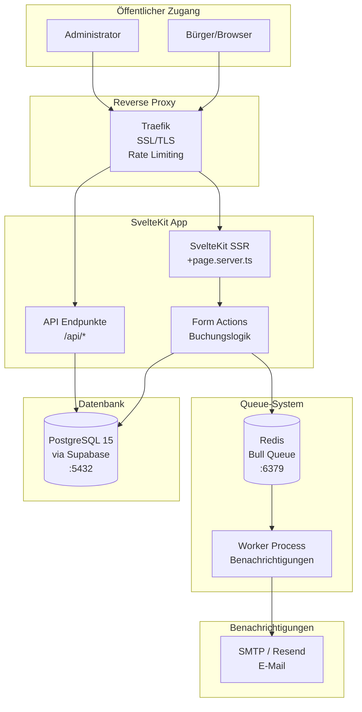
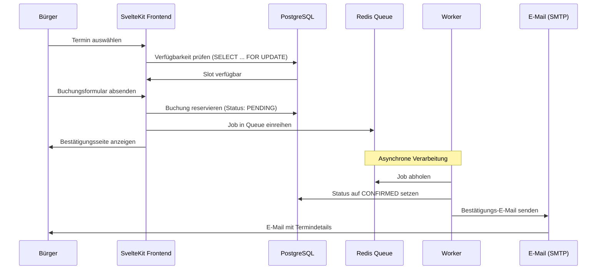
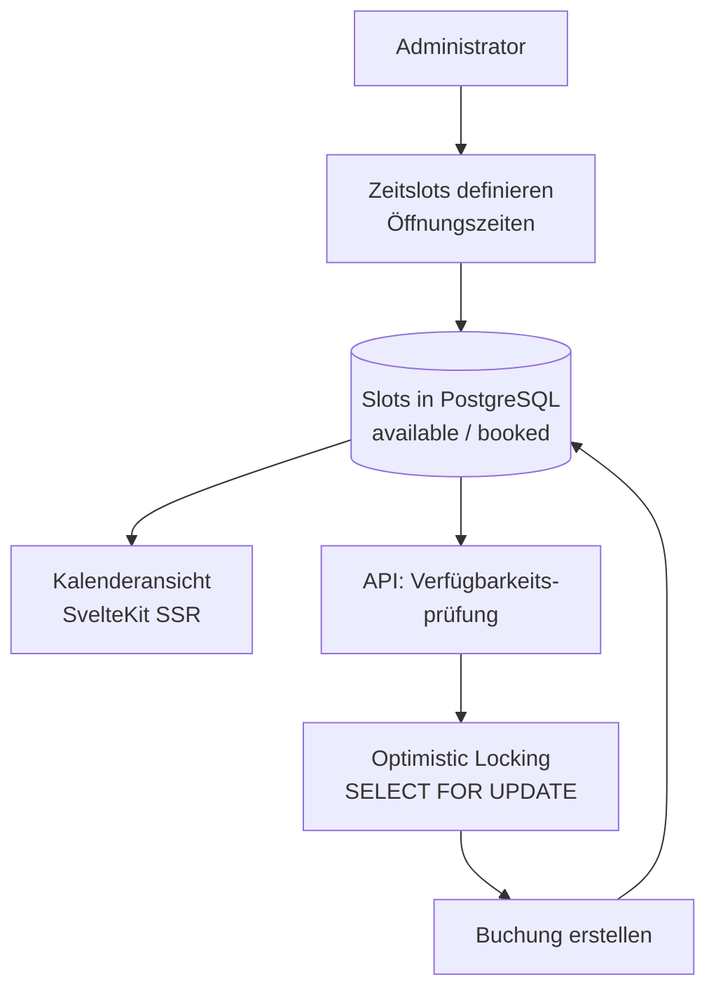
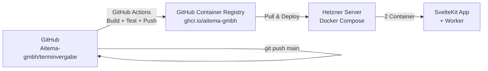

# aitema|Termin – Technische Architektur

## Übersicht

aitema|Termin ist eine SvelteKit-basierte Terminvergabe-Plattform mit asynchroner Buchungsverarbeitung über eine Redis-Queue.

## System-Architektur

## Buchungs-Ablauf

## Kalender-Slot-Verwaltung

## Komponenten

### SvelteKit App
- **Framework**: SvelteKit mit TypeScript
- **Rendering**: SSR + Form Actions (kein separates Backend nötig)
- **Styling**: Tailwind CSS + aitema Design System
- **Kalender**: Native Datepicker + eigene Slot-Logik
- **Validierung**: Zod (server-seitig in Form Actions)
- **Authentifizierung**: Supabase Auth (Admins)

### Queue-System (Redis + Bull)
- **Redis 7**: Datenhaltung für Job-Queue
- **BullMQ**: Job-Queue-Management
- **Worker**: Separater Node.js-Prozess für E-Mail-Versand
- **Retry**: Automatische Wiederholung bei Fehlern (3x)
- **Dead-Letter**: Fehlgeschlagene Jobs werden protokolliert

### Datenbank (PostgreSQL / Supabase)
- **PostgreSQL 15**: Optimistic Locking für Slot-Buchungen
- **Prisma ORM**: Type-safe Datenbankzugriff
- **Row Level Security**: Bürger sehen nur eigene Buchungen
- **Transaktionen**: Atomare Buchungsvorgänge

## Deployment

## Technologie-Stack

| Layer | Technologie | Version |
|-------|-------------|---------|
| Framework | SvelteKit | 2.x |
| Sprache | TypeScript | 5.x |
| Styling | Tailwind CSS | 3.4.x |
| Datenbank | Supabase (PostgreSQL) | 15.x |
| ORM | Prisma | 5.x |
| Queue | Redis + BullMQ | 7.x / 5.x |
| E-Mail | Resend / SMTP | – |
| Container | Docker | 24.x |
